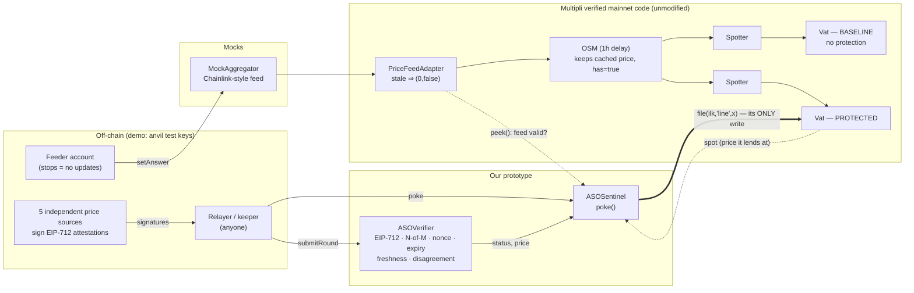
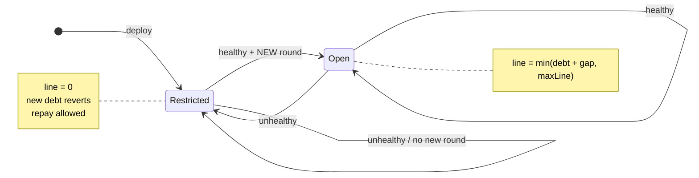

# ASO Sentinel

**An attested-oracle guard that blocks new borrowing in a Multipli-style (MakerDAO-fork) RWA lending
system when price data is stale, disputed or overvalued, while repayments keep working.**

Hackathon prototype for the Multipli Hackathon (GraVITas '26, VIT Vellore). Problem statement:
Web3 oracle reliability, accuracy and resilience.

> **What this is:** a tested prototype that runs **Multipli's own verified mainnet contracts**
> (Vat, Spotter, OSM, PriceFeedAdapter, GemJoin5) on a local chain, side by side with and without our
> protection layer.
>
> **What this is not:** it is not integrated with, deployed to, or endorsed by Multipli, and it is not
> audited. Production use would need Multipli governance to add the Sentinel as a Vat ward, plus real
> price sources and a keeper. See [Known limitations](#known-limitations).

---

## The problem (verified in Multipli's deployed code)

Multipli's rwaUSD system prices PAXG collateral through
`Chainlink feed → PriceFeedAdapter → OSM (1h delay) → Spotter → Vat`
([addresses](https://docs.multipli.fi/technical-architecture/rwausd-contract-addresses.md)).

- **The adapter detects staleness.** `PriceFeedAdapter.peek()` returns `(0, false)` when the feed is
  older than `maxDelay` (24h on mainnet).
- **The OSM throws that signal away.** `OSM.poke()` does nothing when the adapter returns `false`, and
  `OSM.peek()` keeps returning its cached price with `has = true`. It performs no age check.
- **The Vat keeps lending at that price.** The Vat has no notion of oracle freshness, so new rwaUSD can be
  minted against a price of any age.
- **Invalidating the price is worse.** If the OSM ever reported "no price", the Spotter would write
  `spot = 0` and every vault would become liquidatable.

Source: [`src/multipli/osm.sol`](src/multipli/osm.sol) (`poke`/`peek`),
[`src/multipli/adapter.sol`](src/multipli/adapter.sol) (`peek`),
[`src/multipli/spot.sol`](src/multipli/spot.sol) (`poke`). Mainnet configuration (read at block
26,009,365): `mat` 140%, OSM `hop` 3600s, adapter `maxDelay` 86,400s, ilk `line` 1,000,000 rwaUSD,
`dust` 100 rwaUSD. Our demo uses the same values. Details are in [docs/PROVENANCE.md](docs/PROVENANCE.md).

Test `test_S6b_FeederStops25h_BaselineStillLends_ProtectedBlocks` reproduces this with Multipli's
unmodified contracts. After 25h without feed updates, the adapter says "stale", the OSM still says
"valid", and the baseline Vat lends 150,000 rwaUSD against the 25-hour-old price.

## What we built

| Component | What it does |
|---|---|
| [`ASOVerifier`](src/ASOVerifier.sol) | Verifies rounds of **EIP-712 signed price attestations** from an **N-of-M** source set (3-of-5 in the demo). Checks signatures (bound to chain ID and contract), authorized and **distinct** sources, **quorum** (must be a strict majority), **freshness**, **expiry**, a bounded validity window, a **strictly increasing nonce** (replay protection), and **cross-source agreement**. A disagreeing round is recorded as `DISPUTED` rather than reverted. Status is computed at read time, so data becomes `STALE` without any transaction. Field names and statuses follow Multipli's documented oracle-profile design ([docs](https://docs.multipli.fi/technical-architecture/collateral-and-oracle-profile.md)). |
| [`ASOSentinel`](src/ASOSentinel.sol) | A permissionless `poke()` that sets **only** the collateral debt ceiling (`vat.file(ilk, "line", x)`). **Unhealthy** data (ASO halted, disputed, missing or stale; Multipli's adapter reporting a stale feed; or the Vat lending above the fresh attested price) sets `line = 0`, so every new-debt `frob` reverts `Vat/ceiling-exceeded`. Repayments keep working because the Vat skips the ceiling check when debt decreases. **Healthy** data sets `line = min(debt + gap, maxLine)`, so if nobody pokes after data goes bad, exposure is bounded by the remaining headroom. **Recovery** requires a *new* accepted round after the incident. The Sentinel **never changes the collateral price**. |

Why ceiling = 0 and not "current debt": with `line = debt`, every repayment frees room that someone
else can immediately re-borrow at the bad price. Test `test_RepaidRoomCannotBeReborrowedWhileRestricted`
fails if the Sentinel is changed to cap at current debt (we checked by mutation).

## Architecture





*Unhealthy* means any of: ASO `HALTED`, `DISPUTED`, `NO_DATA` or `STALE`; Multipli's adapter reports a
stale feed (or reverts); or the Vat's price is more than 2% above the fresh attested price. Every
transition happens on a permissionless `poke()`.

More detail: [docs/ARCHITECTURE.md](docs/ARCHITECTURE.md).

## What is real, what is ours, what is mocked

| Category | Items |
|---|---|
| **Verified Multipli behavior** (their mainnet source, byte-identical, compiled with their settings) | `Vat`, `Spotter`, `OSM` (+ ds-value/thing/auth/note/math), `PriceFeedAdapter`, `GemJoin5`. Run `node script/vendor/verify-multipli-sources.mjs` to re-check against Blockscout. |
| **Our prototype** | `ASOVerifier`, `ASOSentinel`, deploy script, tests, demo runner. |
| **Mocked / simulated** | `MockAggregator` (Chainlink-style feed; "feeder stops" = no updates), `MockRWA` (PAXG stand-in), the 5 price sources (anvil test keys, not real data providers), time (anvil `evm_increaseTime`), keeper/relayer (demo script). Liquidations (Dog/Clipper), stability fees (Jug) and the rwaUSD ERC-20 exit (rwaUSDJoin) are **not deployed**. |
| **Future integration (not done)** | Multipli governance `vat.rely(sentinel)`; real attestation sources with independent data; keeper incentives; a Vat-level hook for collateral withdrawals (see limitations); timelock/multisig ownership. |

## Quickstart

Requires [Foundry](https://book.getfoundry.sh/) (tested with v1.8.3) and Node ≥ 20.

```bash
git clone --recurse-submodules <repo> && cd aso-sentinel
forge build
forge test                       # unit, fuzz and invariant tests
cd demo && npm ci && npm run demo  # on-chain demo on a fresh local anvil chain (~10 s)
```

`npm run demo` starts its own anvil (port 8546), deploys with `forge script script/Deploy.s.sol`, and
runs every scenario as **real transactions**. Failing transactions are mined, so they appear on-chain
with status `reverted` and their decoded reasons. It ends with an expected-vs-actual table and exits
non-zero if any scenario misbehaves.

## Demo scenarios

| # | Scenario | Protected system (on-chain result) | Baseline | Test |
|---|---|---|---|---|
| S1 | Valid fresh 3-of-5 attestations | borrow succeeds | borrow succeeds | `test_S1_…` |
| S2 | Stale data / expired attestation | submit reverts `Expired(0)`; borrow reverts `Vat/ceiling-exceeded` | still lends | `test_S2_…` |
| S3 | Sources disagree beyond 1% | round recorded `DISPUTED`; borrow reverts | n/a | `test_S3_…` |
| S4 | Forged / wrong-key / outsider / duplicate signature | reverts `InvalidSignature` / `UnauthorizedSigner` / `SignersNotStrictlyAscending` | n/a | `test_S4_…`, verifier suite |
| S5 | Replayed round / old nonce | reverts `NonceNotIncreasing` | n/a | `test_S5_…` |
| S6 | Feeder frozen while market drops 40% | Sentinel restricts; borrow reverts | **mints 178k rwaUSD against $150k of collateral** | `test_S6a_…`, `test_S6b_…` |
| S7 | Fresh valid data after incident | borrowing restored, only after a *new* round | — | `test_S7_…` |
| S8 | Repay during restriction | partial and full repay succeed | — | `test_S8_…` |

Talk track for a 2–3 minute live demo: [docs/DEMO.md](docs/DEMO.md).

## Security evidence

- **91 tests** (`forge test`): 55 verifier tests, 21 Sentinel tests, 14 scenario tests and 1 invariant
  suite. The invariant suite checks 6 properties over 128 runs × 64 random calls. The properties: the
  ceiling never exceeds `maxLine`; restricted ⇒ ceiling = 0; no borrow ever succeeds while restricted;
  repayments that respect the Vat's dust rule never fail; a poke never changes the collateral price; and
  a consistent nonce state.
- **Coverage** (`forge coverage`): `ASOSentinel` 100% lines/branches; `ASOVerifier` 98% lines, 100% branches/functions.
- **Mutation testing** ([test/mutation/run_mutations.py](test/mutation/run_mutations.py)): 17 mutants
  each remove or weaken one security check, and **all 17 are caught** by at least one failing test.
- **On-chain demo:** 22 expected-vs-actual checks from mined transactions.
- Full review, findings and residual risks: [docs/AUDIT.md](docs/AUDIT.md).
- Sepolia testnet deployment guide: [docs/SEPOLIA.md](docs/SEPOLIA.md).

## Known limitations

1. **Collateral withdrawal is not blocked.** Capping `line` stops new debt, but the Vat still lets a user
   withdraw collateral down to the (possibly stale-high) `spot`. Closing this without touching `spot`
   (which risks liquidations) needs a Vat-level hook that Multipli's Vat doesn't have. This is
   demonstrated honestly in `test_KnownLimitation_CollateralWithdrawalAtStalePriceNotBlocked`.
2. **Keeper dependency.** Restriction happens when someone calls `poke()`. Until then, new debt is
   bounded by the headroom left at the last healthy poke (`gap`, 200k rwaUSD in the demo), not by the
   stale price (`test_KeeperLag_ExposureBoundedByHeadroom`). There is no keeper incentive.
3. **A single faulty authorized source can force `DISPUTED`.** This is fail-closed: new borrowing
   pauses, but nothing is liquidated. It is a liveness-for-safety trade-off.
4. **Relayer choice among valid signatures.** With more than N valid signatures, the relayer chooses
   which N to submit. Any accepted round must agree within `maxDeviationBps` (1%), so the influence is
   bounded to that band. A majority quorum means a minority can't produce `OK`.
5. **Admin trust.** Owners can change the source set and parameters (within bounds). The demo uses a
   single EOA; production would need a timelock/multisig. The Sentinel's only Vat privilege is setting
   `line`, and it can never raise `line` above `maxLine`.
6. **Not audited; local chain only.** The deploy script refuses non-anvil chains because it uses public
   test keys.

## Prior art (this is not a new idea)

- **Aave `PriceOracleSentinel`:** blocks borrowing when the oracle or sequencer is down.
- **MakerDAO `DssAutoLine`:** the debt-ceiling headroom pattern.
- **RedStone / Chainlink Data Streams:** signed price reports with timestamps and expiry.
- **Pyth:** freshness-bounded reads and confidence intervals.
- **Multipli's own docs:** describe signed N-of-M feeds with `OK / STALE / DISPUTED / HALTED` statuses.

Our contribution is a working, tested implementation of that documented behavior, wired to Multipli's
actual deployed contracts, together with a reproducible demonstration of the OSM staleness gap.

## Parameters (demo)

| Parameter | Value | Source |
|---|---|---|
| `mat`, OSM `hop`, ilk `line`, `dust`, adapter `maxDelay` | 140%, 3600s, 1M, 100, 24h | Multipli mainnet (block 26,009,365) |
| Quorum | 3 of 5 (strict majority required) | prototype |
| `maxAge` / `maxValidity` / `maxDeviationBps` | 1h / 2h / 1% | prototype |
| Sentinel `gap` / `maxLine` / `maxPriceGapBps` | 200k / 1M / 2% | prototype |

## License

AGPL-3.0-or-later. The vendored Multipli (MakerDAO/dss-derived) sources are AGPL-3.0 / GPL-3.0; see
their headers.
